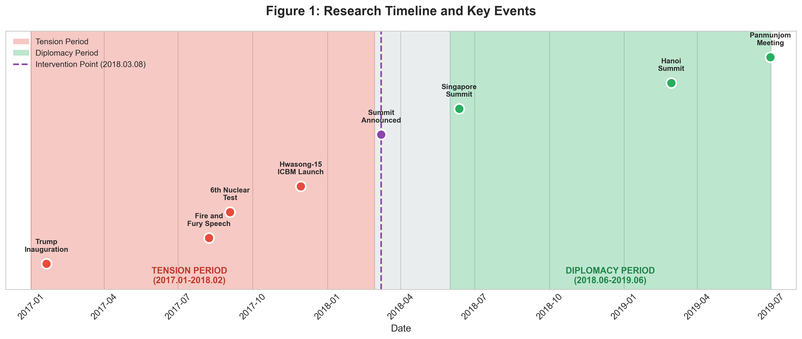
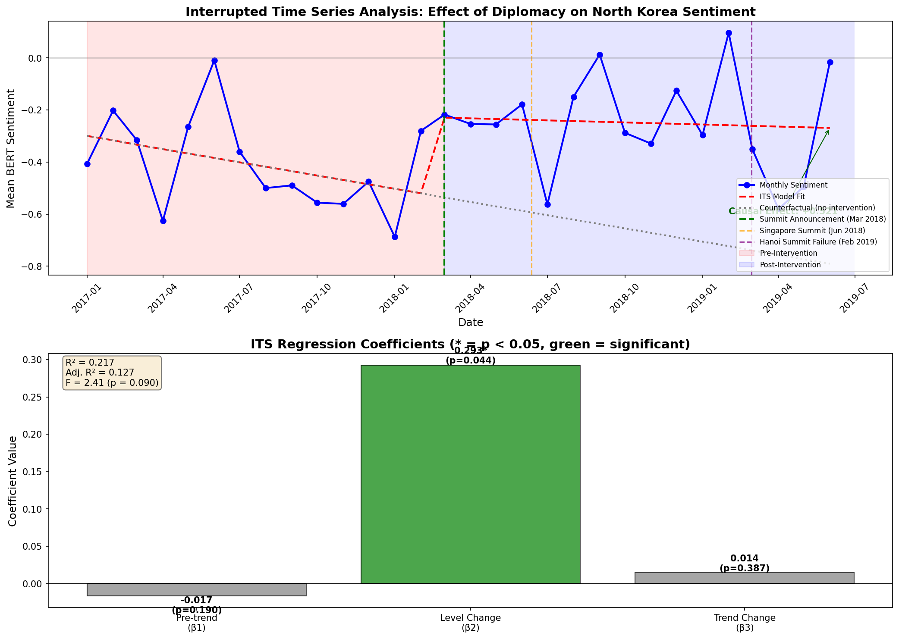
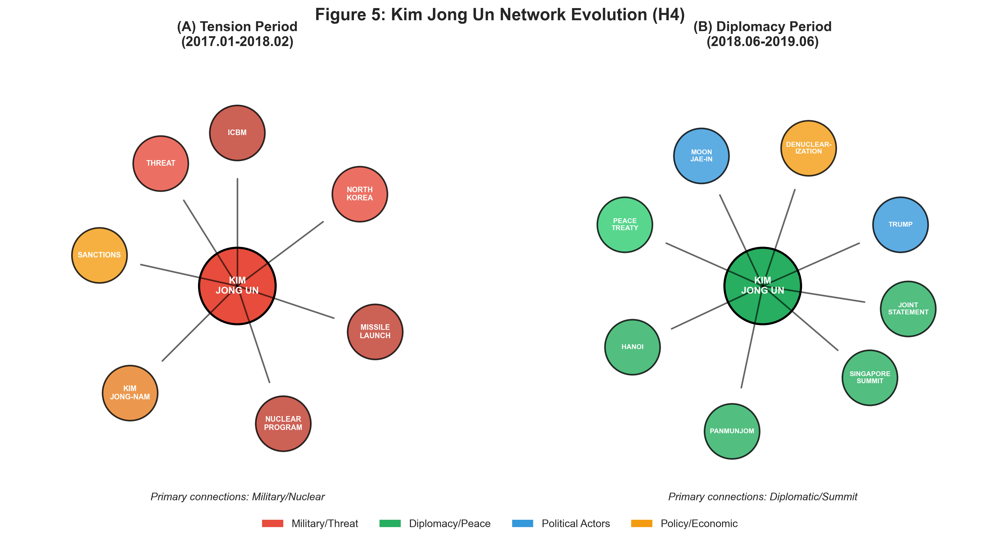

# NK Coercive Diplomacy: Reddit Analysis

**The Impact of North Korea's Coercive Diplomacy Strategy on U.S. Online Public Opinion**

[](https://www.python.org/downloads/)
[](https://opensource.org/licenses/MIT)

---

## Overview

This repository contains the code and data for analyzing how North Korea's coercive diplomacy strategy (2017-2019) affected U.S. public opinion on Reddit. We examine the transition from maximum tension (nuclear tests, ICBM launches, "Fire and Fury") to diplomatic engagement (Singapore/Hanoi Summits).

### Key Findings

| Hypothesis | Method | Result | Significance |
|------------|--------|--------|--------------|
| **H1**: Sentiment Improvement | BERT + t-test | ✅ Supported | p < 0.001 |
| **H2**: Framing Shift | GPT-4o-mini + χ² | ✅ Supported | p < 0.001 |
| **H3**: Causal Effect | ITS Regression | ✅ Supported | p = 0.044 |
| **H4**: Knowledge Structure | GraphRAG | ✅ Supported | Qualitative |

---

## Visual Summary

### Figure 1: Research Timeline


### Figure 2: Sentiment Change (H1)


**Key Result**: Sentiment improved from **-0.475** to **-0.245** (+0.230, p < 0.001)

### Figure 3: Framing Shift (H2)


**Key Result**: THREAT frame decreased **29.3%p**, DIPLOMACY frame increased **22.7%p**

### Figure 4: ITS Causal Analysis (H3)


**Key Result**: Summit announcement caused immediate sentiment improvement (β₂ = +0.293, p = 0.044)

### Figure 5: Knowledge Graph Evolution (H4)


**Key Result**: Kim Jong Un's network shifted from military to diplomatic connections

---

## Data

### Dataset Summary

| Category | Tension Period | Diplomacy Period | Total |
|----------|----------------|------------------|-------|
| Posts | 380 | 326 | 706 |
| Comments | 5,123 | 4,337 | 9,460 |
| Period | 2017.01-2018.02 | 2018.06-2019.06 | - |

### Data Access

- **Sample Data**: `data/sample/` (50 posts per period, included in repo)
- **Full Dataset**: [Google Drive Link](https://drive.google.com/drive/folders/1NRIMwN4X3fLKZdRlwQWoY8747EeXDetn?usp=sharing)
- **Analysis Results**: `data/results/` (all JSON files included)

See [data/README.md](data/README.md) for detailed data documentation.

---

## Installation

### Requirements

- Python 3.9+
- CUDA-compatible GPU (optional, for faster BERT inference)

### Setup

```bash
# Clone repository
git clone https://github.com/yourusername/nk-coercive-diplomacy-reddit.git
cd nk-coercive-diplomacy-reddit

# Create virtual environment
python -m venv venv
source venv/bin/activate  # On Windows: venv\Scripts\activate

# Install dependencies
pip install -r requirements.txt

# (Optional) Set OpenAI API key for framing analysis
export OPENAI_API_KEY="your-api-key"
```

---

## Usage

### Quick Start: View Results

All analysis results are pre-computed and included. To view:

```bash
# View sentiment comparison
cat data/results/sentiment_comparison_results.json

# View framing results
cat data/results/openai_framing_results.json

# View ITS causal analysis
cat data/results/its_analysis_results.json
```

### Run Analysis

```bash
cd src

# Run complete analysis (uses sample data)
python run_analysis.py

# Skip sentiment analysis (use pre-computed)
python run_analysis.py --skip-sentiment

# Generate figures only
python visualizations.py
```

### Individual Components

```python
# Sentiment Analysis
from sentiment_analysis import SentimentAnalyzer, compare_periods
analyzer = SentimentAnalyzer()
df = analyzer.analyze_dataframe(your_df, text_column='text')

# Framing Analysis (requires OpenAI API key)
from framing_analysis import FramingAnalyzer
analyzer = FramingAnalyzer()
result = analyzer.classify_post(title, body)

# ITS Analysis
from its_analysis import ITSAnalyzer, interpret_its_results
analyzer = ITSAnalyzer(intervention_date="2018-03-08")
results = analyzer.fit_its_model(monthly_data)
```

---

## Repository Structure

```
nk-coercive-diplomacy-reddit/
├── README.md                      # This file
├── requirements.txt               # Python dependencies
├── LICENSE                        # MIT License
│
├── paper/                         # Research paper
│   ├── paper_english.md           # English version
│   ├── paper_korean.md            # Korean version
│   └── analysis_report.md         # Detailed methodology
│
├── data/
│   ├── README.md                  # Data documentation
│   ├── sample/                    # Sample data (50 posts/period)
│   └── results/                   # Analysis results (JSON)
│
├── src/                           # Source code
│   ├── config.py                  # Configuration
│   ├── sentiment_analysis.py      # BERT sentiment
│   ├── framing_analysis.py        # LLM framing
│   ├── its_analysis.py            # Causal inference
│   ├── visualizations.py          # Figure generation
│   └── run_analysis.py            # Main script
│
├── figures/                       # Paper figures
│   ├── fig1_research_timeline.png
│   ├── fig2_sentiment_distribution.png
│   ├── fig3_framing_shift.png
│   ├── fig4_its_analysis.png
│   ├── fig5_knowledge_graph.png
│   └── fig6_summary_dashboard.png
│
└── graphrag/                      # Knowledge graph results
    ├── README.md                  # GraphRAG documentation
    ├── settings.yaml              # GraphRAG config
    ├── period1/                   # Tension period graph
    └── period2/                   # Diplomacy period graph
```

---

## Methodology

### 1. Sentiment Analysis (H1)
- **Model**: BERT (nlptown/bert-base-multilingual-uncased-sentiment)
- **Scale**: -1 (very negative) to +1 (very positive)
- **Tests**: Independent t-test, Mann-Whitney U, Cohen's d

### 2. Framing Analysis (H2)
- **Model**: OpenAI GPT-4o-mini
- **Categories**: THREAT, DIPLOMACY, NEUTRAL, ECONOMIC, HUMANITARIAN
- **Sample**: 150 posts per period (300 total)
- **Test**: Chi-square (χ²)

### 3. Interrupted Time Series - ITS (H3)
- **Model**: Y_t = β₀ + β₁T + β₂X_t + β₃(T×X_t) + ε_t
- **Intervention**: March 8, 2018 (Summit announcement)
- **Key coefficient**: β₂ (immediate level change)

### 4. Knowledge Graph Analysis (H4)
- **Tool**: Microsoft GraphRAG
- **Analysis**: Entity extraction, relationship mapping, community detection
- **Comparison**: Tension vs Diplomacy period network structures

---


## License

This project is licensed under the MIT License - see the [LICENSE](LICENSE) file for details.

---

## Acknowledgments

- Research collaboration with UT Austin (Professor Mohit Singhal)
- Data source: Reddit via Arctic Shift API
- Analysis tools: HuggingFace Transformers, OpenAI, Microsoft GraphRAG

---

## Contact

- **Author**: Jun Sin
- **Email**: [your-email]
- **Issues**: Please use GitHub Issues for questions and bug reports
